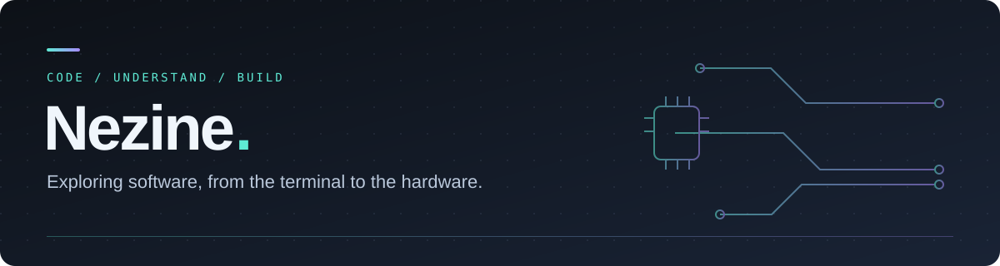

  

  <strong>C / C++ &nbsp;·&nbsp; Linux &nbsp;·&nbsp; Embedded systems</strong> 
  Learning one layer at a time. Building something useful along the way.

---

### Hello, I'm Nezine

I'm learning systems programming and embedded development through small, practical projects. I'm interested in how software works underneath the surface: processes, memory, communication, and the hardware it runs on.

Most of my work starts in a Linux terminal, with C, C++, or Python and a question I want to understand better.

### Selected projects

| Project | What I'm building |
| :--- | :--- |
| **[OpenCode Discord](https://github.com/Nezine/opencode-discord)** | A Discord bridge for OpenCode, with streamed replies, conversation controls, and a native C++ engine. **Python · C++ · Linux** |
| **[Cold Chain Logistics](https://github.com/Nezine/cold-chain-esp32-logistics)** | A team project exploring cold-chain monitoring, with sensor simulation and an ESP32 learning track. **Python · IoT · ESP32** |
| **[Simple Shell](https://github.com/Nezine/simple-shell)** | A small shell with basic commands, built to explore systems programming. **C · Shell** |

### On my workbench

- **Firmware:** learning ESP32 development, sensor readings, and timing.
- **Systems:** exploring C/C++, memory, processes, and operating systems.
- **Linux:** making tools easier to run, debug, and maintain.

### Tools I work with

  
  
  
  
  
  

> Build a small piece. Understand how it works. Make it better.

  Explore the projects above to see what I'm learning and building.

